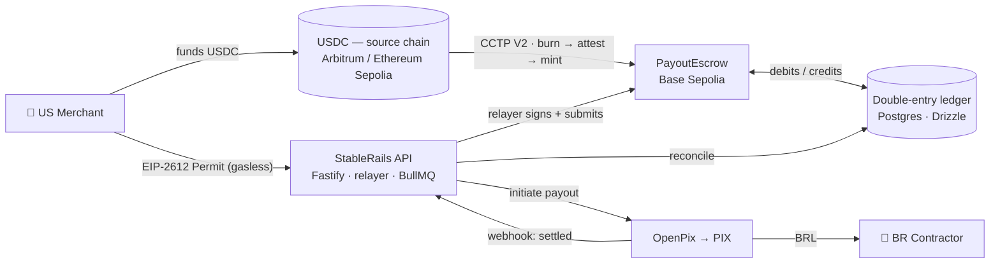

# StableRails

**B2B stablecoin payout rail — US merchants pay Brazilian contractors in USDC, delivered as BRL over PIX.**

> **Status:** 🚧 In active development (solo build). This repo tracks the architecture, plan, and implementation. See [`docs/IMPLEMENTATION_PLAN.md`](docs/IMPLEMENTATION_PLAN.md).

Merchants fund in **USDC** — on any supported chain, bridged natively via **Circle CCTP V2** (no wrapped tokens). StableRails escrows on-chain, records every movement in a **Postgres double-entry ledger**, and pays out **BRL instantly over PIX** — with a single correlation id tracing each payout end-to-end and a continuously-verified invariant that the ledger always equals the on-chain balance.

## Why it exists
Cross-border contractor payouts are slow, opaque, and expensive. USDC settles globally in seconds; **PIX** delivers BRL instantly in Brazil. StableRails is the rail between them, built to **bank-grade** standards: exactly-once payouts, reconciled books, and full observability.

## Architecture



Every step shares one **OpenTelemetry correlation id** (merchant → USDC → CCTP → ledger → PIX), so a payout is traceable end-to-end.

## What makes it interesting (engineering)
- **Bank-grade ledger invariant** — a Postgres **double-entry** ledger where `sum(ledger) == on-chain escrow balance` is **continuously verified and alerted**.
- **Native cross-chain USDC** — **Circle CCTP V2** burn → attest → mint (no wrapped IOUs), settling on Base; explicit handling of attestation latency and stuck-mint recovery.
- **Gasless UX** — merchants approve via **EIP-2612 Permit**; a **resilient backend relayer** signs and submits (idempotent, nonce-safe, replace-by-fee for stuck txs). Decustody roadmap: **ERC-4337** / EIP-712 vouchers.
- **Exactly-once payouts** — idempotency keys end-to-end so a retried request never double-submits a tx or double-pays PIX.
- **Full observability** — OpenTelemetry traces/metrics/logs with the golden signals + the invariant as a first-class alert.
- **Correctness discipline** — USDC is **6 decimals**; every conversion is explicit and tested. Contracts covered by Foundry **invariant** and **fork** tests.

## Tech stack
| Layer | Tech |
|---|---|
| Monorepo | pnpm + Turborepo, TypeScript |
| API / relayer | Fastify · tRPC · viem/wagmi · BullMQ |
| Ledger | Postgres · Drizzle ORM (double-entry) |
| Cross-chain | Circle CCTP V2 (IRIS attestations) |
| Off-ramp | OpenPix (PIX) |
| Contracts | Solidity · Foundry (unit / invariant / fork) |
| Observability | OpenTelemetry |
| Frontend | Next.js · wagmi · RainbowKit |

## Chains (testnet)
- **Settlement / home chain:** Base Sepolia (`PayoutEscrow`).
- **Source chains (CCTP V2):** Arbitrum Sepolia, Ethereum Sepolia.

## Monorepo layout
```
stablerails/
├── apps/
│   ├── web/          # Next.js — merchant dashboard (connect wallet, sign Permit, track status)
│   └── api/          # Fastify/tRPC — backend + relayer + BullMQ workers
├── packages/
│   ├── contracts/    # Foundry — PayoutEscrow.sol + invariant/fork tests
│   ├── ledger/       # Drizzle schema + double-entry logic + reconciliation
│   ├── cctp/         # CCTP V2 client (burn → attest via IRIS → mint)
│   ├── pix/          # OpenPix client (payout + webhook)
│   ├── core/         # shared types, money/decimals (USDC 6), correlation-id
│   └── config/       # shared tsconfig / eslint
└── docs/
    └── IMPLEMENTATION_PLAN.md
```

## Roadmap
- [ ] **Vertical slice** — USDC → escrow → ledger → PIX end-to-end (testnet + sandbox)
- [ ] `PayoutEscrow` — Permit intake, release authorization, UUPS upgradeability, invariant tests
- [ ] CCTP V2 client — burn → attest → mint + stuck-mint recovery
- [ ] Double-entry ledger — schema, entries, reconciliation job, on-chain↔ledger invariant check
- [ ] OpenPix — payout initiation + webhook reconciliation
- [ ] Gasless — EIP-2612 Permit + resilient relayer (idempotent / nonce-safe)
- [ ] Observability — correlation id, dashboards, alerts
- [ ] Compliance — KYB onboarding + sanctions screening
- [ ] Merchant dashboard
- [ ] Decustody — ERC-4337 / EIP-712 vouchers

## Local development

Prerequisites: Node 22 (`.nvmrc`), pnpm 10 (`corepack enable`), Docker, and [Foundry](https://getfoundry.sh) for the contracts package. Integration paths (later phases) additionally need Circle IRIS sandbox access and OpenPix sandbox credentials — see `.env.example`, which documents every variable.

```bash
git clone --recurse-submodules <repo> && cd stablerails
pnpm install
pnpm compose:up      # Postgres 16, Redis 7, Grafana LGTM (localhost:3001)
pnpm check           # turbo: lint + typecheck + test + build
pnpm --filter @stablerails/api dev   # API on http://localhost:3000/healthz

# contracts (Foundry has its own CI job; turbo does not run forge):
cd packages/contracts && forge test
```

## About
Personal portfolio project demonstrating **stablecoin-infrastructure** engineering: cross-chain USDC settlement, on-chain escrow with a reconciled double-entry ledger, gasless UX, and production-grade reliability/observability.

## License
MIT
