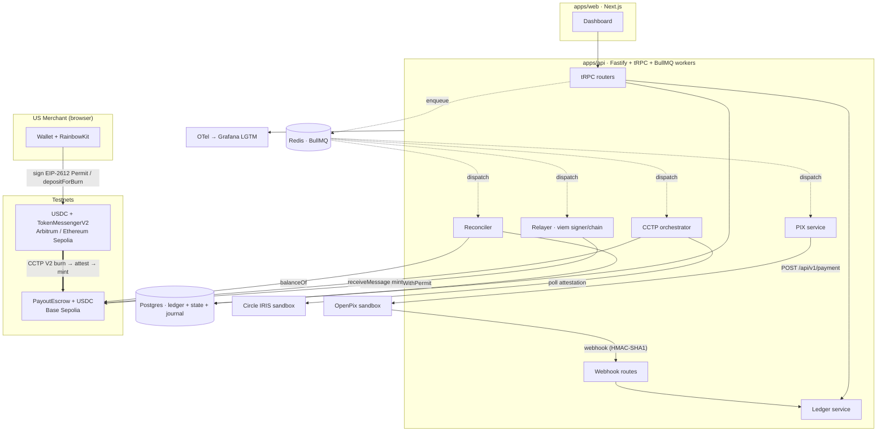

# StableRails — Implementation Plan

> **Scope of this document.** StableRails' repo currently contains only the README (which fixes the architecture, stack, chains, and monorepo layout) and this plan. Everything below is therefore *delta*: the README's decisions are treated as settled contracts, not restated — where reality forced a refinement (e.g., BullMQ vs. the proven AI-DLH Postgres queue), the reconciliation is called out explicitly. The plan also inventories and reuses the sibling **AI-DLH** repo (`all` in this workspace), whose relayer/queue is the single biggest de-risking asset.
>
> **Conventions.** `⚠️ assumption` marks something you must confirm (all collected in §7). Facts about CCTP V2 and OpenPix below were verified against primary sources on 2026-07-11: Circle's official sample app ([circlefin/circle-cctp-crosschain-transfer](https://github.com/circlefin/circle-cctp-crosschain-transfer) — `chains.ts`, `use-cross-chain-transfer.ts`), Circle's `TokenMessengerV2.sol`/`MessageTransmitterV2.sol` sources, and the OpenPix docs repository ([Open-Pix/developers](https://github.com/Open-Pix/developers)).

---

## Workspace inventory (what exists today)

### StableRails (`stablerails/`)
| Area | State |
|---|---|
| Contracts, backend, ledger, queue, CCTP client, PIX client, frontend, CI | **Nothing exists.** Single commit: `README.md`, `LICENSE` (MIT), `.gitignore`. |
| README | High quality and **binding**: fixes the mermaid architecture, stack table, chain choices (Base Sepolia settlement; Arbitrum/Ethereum Sepolia sources), monorepo layout (`apps/web`, `apps/api`, `packages/{contracts,ledger,cctp,pix,core,config}`), and a 10-item roadmap whose first item is the vertical slice. |
| Contradictions with the brief | None material. Two ambiguities resolved in this plan: (1) "Fastify and/or tRPC" → **Fastify host + tRPC v11 router mounted via the Fastify adapter**, with plain Fastify routes for webhooks (OpenPix cannot call tRPC) — §2c. (2) "BullMQ for the async on-chain queue" vs. AI-DLH's proven Postgres-as-queue → **Postgres stays the system of record for payout state; BullMQ schedules/dispatches work** — §2c. |

### AI-DLH (`all/` — the reusable asset)
Node/tRPC v10 + Express + Drizzle 0.29 + Hardhat monorepo (npm workspaces), 52 commits, ~157 tests, deliberately hardened. The fingerprint matches the brief: `LearningProgress.sol` with `recordCompletion` + `ModuleCompleted`, custodial backend wallet, resilient on-chain queue.

**What its queue/signer actually is** (first-hand read, file:line refs):
- **Postgres-as-queue, not BullMQ**: rows in `progress_records` with `blockchain_status ∈ {none,pending,processing,confirmed,failed,failed_permanent}` (`server/db/schema.ts:76-106`); in-process `setInterval` poller (15 s tick), batch of 10, ordered oldest-first (`server/services/blockchain-queue.service.ts:126-153`).
- **Atomic claim**: single conditional `UPDATE … SET status='processing', locked_at=now(), attempts=attempts+1 WHERE id=? AND (claimable) RETURNING` — losers get empty RETURNING and skip (`blockchain-queue.service.ts:170-205`). Attempt counter incremented **at claim time** so a crash mid-send still consumes an attempt.
- **Crash recovery**: rows stuck in `processing` past `BLOCKCHAIN_STALE_LOCK_MS` (10 min) are reclaimed.
- **Retry policy**: fixed backoff table `[1 min, 5 min, 30 min]` clamped, max 5 attempts → `failed_permanent`; explicit error taxonomy — only `CALL_EXCEPTION` (revert) and deleted-parent are non-retryable; `INSUFFICIENT_FUNDS` is deliberately retryable because the wallet can be topped up (`web3.service.ts:166-182`).
- **Replace-by-fee**: on 90 s confirmation timeout, re-send same nonce/data with fees ×1.25; handles `TRANSACTION_REPLACED/repriced` as success and `NONCE_EXPIRED` by recovering the original receipt (`web3.service.ts:42,191-251`).
- **Nonce strategy**: none explicitly — strictly sequential sends from a single ethers-v6 `Wallet` make auto-nonce safe (`blockchain-queue.service.ts:155-158`).
- **DB-level idempotency**: partial unique index `ON (user_id, module_id) WHERE blockchain_status <> 'none'` makes double-payout impossible at the DB level; the API catches `23505` (`schema.ts:109-127`). Known gotcha: drizzle-kit 0.20.x drops `.where()` from generated SQL — the partial clause is hand-maintained in the migration.
- **Ops**: wallet low-balance monitor cached into `/healthz` (`wallet-monitor.service.ts`), zod-validated env with fail-fast (`utils/env.ts`), "honest CI" (no `|| true` masking).

**Known gaps (StableRails must fix, not inherit)**: no pre-broadcast tx-hash persistence → a crash between send and DB write can double-submit; stale-lock reclaim is unsafe with >1 instance; only 1-confirmation finality; the signer layer (RBF, timeouts, error mapping) has **zero tests**; ethers v6, not viem.

**Reused in this plan**: the state machine + atomic-claim semantics, attempt-at-claim, stale-lock recovery, error taxonomy, RBF strategy, partial-unique-index idempotency, wallet monitor, zod env pattern, tRPC middleware/test patterns (`vi.hoisted` mocks + `createCaller`), `.env.example`-as-operator-docs, honest-CI policy. Ported to viem + BullMQ semantics in §2c — a rewrite of the *code*, a reuse of the *design and its test cases*.

### Sibling repos (secondary sweep)
| Repo | Verdict | Reused |
|---|---|---|
| `swiss-defi-optimizer` | Hardhat ERC-4626 USDC vault + mock compliance module; 77 unit tests; strongest CI | CI workflows (Slither job, gas-report PR comment via `actions/github-script`, scheduled security audit) — **removing its `continue-on-error: true` flags**; vault security idioms (emergency shutdown, caps); the allowlist-gate compliance *shape* (it is a self-declared mock — pattern only) |
| `privacy-treasury-ai` | Hackathon Express API; viem/wagmi deps are declared but never imported (dead) | zod request-schema style; the 46-component shadcn/ui kit is regenerated (not ported) for the dashboard |
| `ai-boxing-instructor` | Polished React 19 PWA, no web3 | typed-error outbound HTTP client with transient-only bounded retry + AbortController (`src/services/coachClient.ts`) — template for the OpenPix/KYB clients; minimal lint→typecheck→test→build CI matrix |

None of the siblings contain Turborepo, Foundry, BullMQ, OTel, Drizzle-latest, webhook HMAC, or double-entry anything — all of that is greenfield here.

---

## 0) Thesis

- **It sits exactly on the seam the hiring companies live on** — fiat↔stablecoin settlement. Circle (CCTP, USDC), Paxos, Stripe Bridge, Agora, and Tempo all build "move a dollar across a chain boundary and reconcile it" infrastructure; StableRails is that loop in miniature but real: USDC in, CCTP V2 across, PIX (BRL, instant, Brazil's dominant rail) out — built by an engineer in Brazil (UTC-3, adjacent to LatAm expansion roadmaps) with fintech/Internet-Banking background.
- **The centerpiece is a bank-grade invariant, not a feature list**: a Postgres double-entry ledger where `sum(ledger cash accounts) == on-chain PayoutEscrow USDC balance` is expressed three times — as a Foundry invariant test, as an integration-fuzz harness, and as a production reconciliation job that alerts and halts payouts on drift. Most portfolio projects *have* a database; almost none can *prove* their books.
- **Exactly-once, end-to-end, on purpose**: one correlation id (UUIDv7 → `bytes32`) threads merchant intent → Permit → CCTP burn/attest/mint → escrow release → ledger transfer → OpenPix `correlationID` → webhook reconciliation, with idempotency enforced at every boundary (DB unique indexes, on-chain consumed-id mapping, provider correlation ids). A retried request can be *demonstrated* not to double-pay.
- **Real integrations, minimal mocks**: actual CCTP V2 burn→IRIS attest→mint built by hand (with the seam to swap in Circle's Forwarding Service later), actual OpenPix sandbox PIX settlement, actual EIP-2612 Permit gasless funding — against the industry-standard failure modes (stuck mint, failed PIX, stuck tx) each with a tested recovery path.
- **It stands on a proven core instead of a rewrite-from-zero**: the relayer ports AI-DLH's battle-tested queue semantics (atomic claim, attempt-at-claim, RBF, error taxonomy, DB idempotency) and *fixes its documented gaps* (pre-broadcast hash persistence, multi-instance safety, configurable finality) — a senior "evolve the proven design" story, with a decustody roadmap (ERC-4337 + USDC paymaster) showing where custody goes next.

---

## 1) Target architecture

### C4 — Level 1 (System Context)

**StableRails** sits between four external actors: the **US merchant** (funds USDC from a browser wallet on Ethereum/Arbitrum/Base Sepolia; signs EIP-2612 Permits; watches payout status), the **BR contractor** (passive recipient of BRL over PIX; owns a PIX key), **Circle's infrastructure** (USDC contracts, CCTP V2 TokenMessengerV2/MessageTransmitterV2 on all three chains, IRIS attestation sandbox), and **OpenPix/Woovi** (PIX payout API + settlement webhooks, sandbox). A fifth, internal-facing actor is the **operator** (you): funds the relayer wallet, responds to alerts, runs runbooks.

### C4 — Level 2 (Containers)

| Container | Tech | Responsibility |
|---|---|---|
| `apps/web` | Next.js 15, wagmi v2, RainbowKit v2 | Merchant dashboard: connect wallet, KYB status, sign Permit, initiate/track payouts by correlation id |
| `apps/api` | Fastify v5 + tRPC v11 (fastify adapter), viem, BullMQ | API surface, **relayer** (custodial signer), CCTP orchestrator, OpenPix webhook receiver, reconciliation jobs |
| Postgres | Drizzle ORM | **System of record**: double-entry ledger, payout state machines, tx journal, audit trail, idempotency keys |
| Redis | BullMQ | Job scheduling/dispatch only — *never* the source of truth |
| `packages/contracts` | Solidity 0.8.x, Foundry, OZ 5.x | `PayoutEscrow` (UUPS) on Base Sepolia |
| Observability stack | OTel SDK → `grafana/otel-lgtm` (Tempo/Loki/Prometheus/Grafana) | Traces/metrics/logs, invariant + stuck-tx alerting |
| Circle CCTP V2 | TokenMessengerV2 `0x8FE6…2DAA`, MessageTransmitterV2 `0xE737…E275` (same addresses on all three testnets), IRIS `https://iris-api-sandbox.circle.com` | Native burn/mint USDC transport |
| OpenPix sandbox | `app.openpix-sandbox.com`, `POST /api/v1/payment`, webhooks | BRL PIX delivery |

### C4 — Level 3 (Components inside `apps/api`)

- **tRPC routers**: `merchant` (KYB), `payout` (create/list/status), `funding` (quote CCTP route, permit payloads), `admin` (reconciliation status, invariant readout).
- **Webhook module** (plain Fastify routes): `POST /webhooks/openpix` — HMAC-SHA1 verify → enqueue `pix.confirm` job; raw-body capture; replay-safe.
- **Relayer** (`packages/core` types + api workers): `TxSubmitter` (viem `WalletClient`, one per chain, concurrency=1), `TxJournal` (pre-broadcast persistence), RBF policy, nonce discipline.
- **CCTP orchestrator** (`packages/cctp` client + api workers): `BurnExecutor`, `AttestationPoller` (IRIS), `MintSubmitter` — behind `AttestationProvider`/`MintSubmitter` interfaces (the Forwarding Service seam).
- **Ledger service** (`packages/ledger`): posting engine (balanced-entry enforcement), account tree, `Reconciler` (ledger↔chain, ledger↔OpenPix).
- **PIX service** (`packages/pix`): OpenPix client (typed-error, bounded-retry — the `coachClient` pattern), payout initiation, webhook payload parsing.
- **Compliance service**: KYB state machine, sanctions screener (seamed provider), append-only audit writer.

### Architecture diagram

### End-to-end data flow — happy path (one correlation id throughout)

`payoutId` is a UUIDv7 minted at payout creation; on-chain it travels as `bytes32(uuid)` in events; at OpenPix it *is* the `correlationID`; in OTel it is the `stablerails.payout.id` attribute + baggage entry on every span.

1. **Create** — merchant calls `payout.create` (tRPC) with contractor + amount + client-supplied `Idempotency-Key`. API inserts `payouts` row (`state='created'`, unique on idempotency key), posts ledger transfer `merchant:receivable → escrow:incoming` (pending leg), returns `payoutId`. Root OTel span starts.
2. **Fund** — merchant signs Permit (EIP-2612) for the escrow on Base Sepolia, or — cross-chain — approves/burns on Arbitrum/Ethereum Sepolia via `depositForBurn` (CCTP V2, §2b). Relayer submits `depositWithPermit` (gasless for merchant) or the CCTP orchestrator drives burn→attest→mint into the escrow. Escrow emits `Funded(payoutId, merchant, amount)`.
3. **Record** — chain watcher confirms the deposit at N confirmations; ledger posts `escrow:onchain ← merchant:funded` (double entry, balanced); payout `state='funded'`.
4. **Release** — relayer submits `release(payoutId, …)`; escrow transfers USDC to the settlement treasury address, emits `Released(payoutId, …)`; ledger moves `escrow:onchain → treasury:settlement`; `state='releasing'→'released'`.
5. **Pay out** — PIX worker calls OpenPix `POST /api/v1/payment` `{value: centavos, destinationAlias: pixKey, destinationAliasType, correlationID: payoutId}` (+ approve step, §2e); ledger posts `treasury:settlement → pix:in_flight` with the FX rate snapshotted on the transfer; `state='pix_submitted'`.
6. **Confirm** — OpenPix fires `OPENPIX:MOVEMENT_CONFIRMED` webhook; HMAC verified; ledger posts `pix:in_flight → contractor:paid`; `state='settled'`. Root span ends; the whole rail is one trace.
7. **Verify** — the reconciler independently recomputes `sum(ledger escrow accounts) == USDC.balanceOf(escrow)` and ledger↔OpenPix statement parity; emits `stablerails.invariant.drift == 0` metric.

### Failure path 1 — stuck CCTP mint

Burn succeeded on Arbitrum Sepolia; attestation or mint never lands on Base Sepolia.

- CCTP transfer rows carry their own state machine: `burn_submitted → burn_confirmed → attesting → attested → mint_submitted → minted`, each with an entered-at timestamp and a per-state SLA (attesting SLA: 60 s for Fast, 25 min for Standard; mint SLA: 5 min).
- `AttestationPoller` polls `GET {IRIS}/v2/messages/{sourceDomain}?transactionHash={burnTx}` (404 → keep polling; `status:"complete"` → store `message`+`attestation`). Poll is a BullMQ repeatable job keyed by `payoutId` — restart-safe, at-least-once, dedup by job id.
- **SLA breach** fires an alert (Grafana, on `stablerails.cctp.state_age_seconds`) and marks the transfer `stuck_attesting`/`stuck_minting` — *visible in the dashboard, threaded to the same trace via span links*.
- **Recovery, in order**: (1) re-poll IRIS — attestations are re-fetchable at any time by burn tx hash; (2) re-submit `receiveMessage(message, attestation)` — idempotent on-chain: MessageTransmitterV2 rejects a used nonce, so a duplicate submission reverts harmlessly (caught as non-retryable "already processed" → advance state by reading the `MessageReceived` event); (3) if the mint tx itself is stuck, standard relayer RBF applies (§2c); (4) manual runbook: mint via Circle sample app / any EOA — `receiveMessage` is permissionless when `destinationCaller == bytes32(0)`; we set `destinationCaller` to the relayer ⚠️ assumption on the tradeoff, see §2b.
- Funds are *never* ambiguous in the ledger: between burn and mint the amount sits in `cctp:in_transit` (an asset account); the invariant checker knows in-transit amounts are legitimately off-escrow.

### Failure path 2 — PIX payout failure & reconciliation

`POST /api/v1/payment` succeeded (`status=CREATED`) but the payment ends `FAILED`, or no webhook ever arrives.

- OpenPix payments have a documented terminal state machine (`CREATED → PROCESSING → CONFIRMED | FAILED`, both terminal). On `OPENPIX:MOVEMENT_FAILED`: ledger posts the *reversing entry* `pix:in_flight → treasury:settlement` (never mutate/delete entries — corrections are new entries), payout `state='pix_failed'`, alert fires, and a compensation decision is queued for the operator (retry payout with new sub-attempt id vs. refund escrow to merchant — refund path releases back on-chain, again exactly-once by a fresh `payoutId`-derived idempotency key).
- **Missing webhook**: a `pix.reconcile` repeatable job sweeps payouts in `pix_submitted` older than the webhook SLA (5 min) and polls OpenPix `GET /api/v1/payment/{correlationID}` — webhooks are a *latency optimization*, polling is the correctness backstop. OpenPix itself retries webhooks 8× with exponential backoff (`10·2^attempt` s), so both sides are resilient.
- **Duplicate webhook** (OpenPix retries after our 200 was lost): the confirmation handler is idempotent — `webhook_events` table unique on provider event id + payload hash; a replay is acknowledged with 200 and does nothing.
- Every step above shares the payout's correlation id → one trace shows submit, failure, reversal, and compensation.

---

## 2) Layer-by-layer plan

> Task IDs (`C1`, `X2`, …) are referenced by the roadmap (§3). Estimates assume ~6 h/week solo; a "week" below is one such block.

### 2a. Smart contracts — `PayoutEscrow`

**Design.** One upgradeable contract on Base Sepolia holding all escrowed USDC, with per-payout accounting (not per-merchant pooled balances — per-payout is what makes the ledger↔chain mapping 1:1 and the release exactly-once):

- `fundWithPermit(payoutId, merchant, amount, deadline, v, r, s)` — verifies EIP-2612 Permit ([EIP-2612](https://eips.ethereum.org/EIPS/eip-2612)) then `safeTransferFrom`; callable by `OPERATOR_ROLE` (the relayer executes; the *merchant* signed the Permit so custody-of-approval stays with them). Records `payouts[payoutId] = {merchant, amount, Funded}`; rejects a reused `payoutId` (**on-chain idempotency**).
- `fundFromCCTP(payoutId, merchant, amount)` — operator attributes a CCTP mint that landed on the escrow address to a payout id (mint credits plain USDC; attribution is an explicit, evented step so the ledger never guesses). ⚠️ assumption: v1 keeps attribution trusted-operator; a stretch (§6) moves to CCTP V2 `depositForBurnWithHook` + on-chain hook validation.
- `release(payoutId, to)` — `OPERATOR_ROLE`; requires state `Funded`; sets `Released` **before** transfer (CEI), `SafeERC20.safeTransfer`, emits `Released(payoutId, to, amount)`. A second call reverts `AlreadyReleased()` — the on-chain half of exactly-once.
- `refund(payoutId)` — returns funds to the merchant (PIX-failure compensation path), same CEI/idempotency discipline.
- Roles via OZ `AccessControl`: `DEFAULT_ADMIN_ROLE` (multisig-ready; testnet = deployer), `OPERATOR_ROLE` (relayer), `PAUSER_ROLE`; `Pausable` gates fund/release (circuit breaker — triggered by the invariant alert, §2h).
- Upgradeability: **UUPS** (`UUPSUpgradeable`, [ERC-1967](https://eips.ethereum.org/EIPS/eip-1967)) with `_authorizeUpgrade` gated on `UPGRADER_ROLE`, OZ v5.x upgradeable variants, initializer + `_disableInitializers()` in the implementation constructor.

**Key decisions & tradeoffs**

| Decision | Choice | Tradeoff / why it wins here |
|---|---|---|
| Per-payout vs. pooled balances | Per-payout structs keyed by `bytes32 payoutId` | Slightly more gas/storage; buys 1:1 ledger mapping, on-chain replay protection, and a crisp invariant (`Σ funded-not-released == balanceOf` modulo direct transfers) |
| UUPS vs. Transparent proxy | UUPS | Cheaper calls, no proxy-admin contract, and it's the pattern stablecoin infra teams expect you to defend; risk is a botched `_authorizeUpgrade` — covered by upgrade-safety tests + OZ Upgrades plugin checks in CI |
| Permit (EIP-2612) vs. `transferWithAuthorization` (EIP-3009) | Permit, per the brief | USDC (FiatTokenV2_2) supports **both**; EIP-3009 avoids the approve-race and front-running-`permit` nuisance, and Circle promotes it for gasless flows. Staying with 2612 (decided constraint; also what wagmi tooling demos best) but the funding path is isolated in one function so a 3009 variant is a ~1-day addition (§6). Note: `permit` front-running griefing (attacker submits your permit first, making your tx revert) is handled by the standard try/catch-permit-then-check-allowance pattern — documented mitigation in OZ's ERC-2612 guidance |
| Direct-USDC-transfer dust | Tolerated, monitored | Anyone can `transfer` USDC at the escrow; invariant uses `>=` on-chain and exact equality against *attributed* funds; a `skim()` (admin) moves unattributed dust to treasury |
| Custom errors vs. require strings | Custom errors | Cheaper; forge asserts them precisely (`vm.expectRevert(AlreadyReleased.selector)`) |

**Tasks**

| ID | Task | Est. |
|---|---|---|
| C1 | Foundry init in `packages/contracts` (forge + OZ v5 upgradeable via remappings, solc 0.8.2x pinned, `foundry.toml` profiles: default/ci/intense) | 0.5 w |
| C2 | `PayoutEscrow` v1: fundWithPermit / fundFromCCTP / release / refund / pause, roles, UUPS, custom errors, NatSpec, indexed events carrying `payoutId` | 1 w |
| C3 | Unit + fuzz tests: every revert path, role matrix, permit happy/expired/frontrun, event assertions (`vm.expectEmit`), fuzz amounts across 6-decimals ranges | 1 w |
| C4 | **Invariant tests** (`forge test --mt invariant`): handler-based, ghost variables `Σfunded/Σreleased/Σrefunded`; invariants: `usdc.balanceOf(escrow) == Σfunded - Σreleased - Σrefunded + dust`, no payout is both Released and Refunded, paused ⇒ no state transitions ([Foundry invariant testing](https://getfoundry.sh/forge/advanced-testing/invariant-testing)) | 1 w |
| C5 | **Fork tests** against Base Sepolia (`vm.createSelectFork`): real USDC `0x036CbD53842c5426634e7929541eC2318f3dCF7e`, real permit domain (verify `version()` on-chain), gas snapshots | 0.5 w |
| C6 | Deploy scripts (`forge script`) + address registry exported as a tiny TS package; upgrade-safety CI (OZ upgrades checker or `forge inspect` storage-layout diff gate) | 0.5 w |

**Acceptance criteria / DoD**

| # | Criterion |
|---|---|
| A1 | `forge test` green incl. ≥3 invariants at `runs=1000, depth=100` in CI (intense profile weekly) |
| A2 | Fork test funds via real testnet-USDC permit signature and releases; gas snapshot committed |
| A3 | Storage-layout diff job fails CI on incompatible upgrade; a deliberate bad upgrade is demonstrated blocked in a test |
| A4 | 100% of external functions have revert-path tests; slither reports no high/medium (or triaged inline) |
| A5 | `sum(ledger)==escrow` expressible: contract exposes `totalAttributed()` view used by the reconciler |

**Test strategy.** Unit/fuzz (forge) → invariant (handler-based, ghost accounting) → fork (Base Sepolia, real USDC + permit) → the cross-system invariant lives in §2d/§2l harnesses. Mutation-style spot checks: comment out the CEI ordering and confirm the invariant suite fails (documents that the tests bite).

**Top risks**

| Risk | Mitigation |
|---|---|
| Upgrade bricking (bad `_authorizeUpgrade`, storage collision) | UUPS tests + storage-layout CI gate + `_disableInitializers`; runbook: upgrades only via script with `--sig` dry-run on fork |
| Permit domain mismatch on testnet USDC (EIP-712 domain `version` differs) | Fork test C5 reads `DOMAIN_SEPARATOR`/`version()` from the real token; never hardcode |
| Reentrancy on release/refund | USDC is a known token (no hooks), but CEI + `nonReentrant` anyway — defense in depth is the reviewer signal |
| Unattributed direct transfers skewing the invariant | `totalAttributed()` vs `balanceOf` split; `skim()`; invariant uses attributed sum |

### 2b. Cross-chain settlement — CCTP V2

**Design.** `packages/cctp` is a small, typed client + the orchestrator workers in `apps/api`. Verified constants (Circle sample app `chains.ts`, 2026-07):

| Chain | Domain | USDC | TokenMessengerV2 / MessageTransmitterV2 |
|---|---|---|---|
| Ethereum Sepolia | 0 | `0x1c7D4B196Cb0C7B01d743Fbc6116a902379C7238` | `0x8FE6B999Dc680CcFDD5Bf7EB0974218be2542DAA` / `0xE737e5cEBEEBa77EFE34D4aa090756590b1CE275` |
| Arbitrum Sepolia | 3 | `0x75faf114eafb1BDbe2F0316DF893fd58CE46AA4d` | same |
| Base Sepolia | 6 | `0x036CbD53842c5426634e7929541eC2318f3dCF7e` | same |

Flow (per [Circle CCTP docs](https://developers.circle.com/cctp) and the verified V2 sources):

1. **Burn (source chain, merchant-signed)**: `TokenMessengerV2.depositForBurn(amount, destinationDomain=6, mintRecipient=bytes32(escrow), burnToken=USDC, destinationCaller, maxFee, minFinalityThreshold)`. Fast Transfer = `minFinalityThreshold=1000`, Standard = `2000` (verified constants in Circle's sample). `mintRecipient` is the **escrow address** — minted USDC lands directly in escrow, no intermediate hop.
2. **Attest**: poll IRIS sandbox `GET https://iris-api-sandbox.circle.com/v2/messages/{sourceDomain}?transactionHash={burnTx}` until `messages[0].status == "complete"`; response carries `message` + `attestation` bytes. Fast fee: `GET /v2/burn/USDC/fees/{src}/{dst}` returns `minimumFee` in bps — set `maxFee = quoted fee × 1.2 buffer` (sample-app practice).
3. **Mint (Base Sepolia, relayer-signed)**: `MessageTransmitterV2.receiveMessage(message, attestation)` — this is a normal relayer tx (§2c queue), so RBF/retry apply. Duplicate delivery reverts (used nonce) → classified non-retryable-success.

**Key decisions & tradeoffs**

| Decision | Choice | Why |
|---|---|---|
| Fast vs. Standard | **Fast by default** (`minFinalityThreshold=1000`), auto-fallback to Standard above a configurable amount (default 1,000 USDC) | Fast ≈ sub-30 s (soft finality; small USDC fee deducted from mint via `maxFee`) vs. 13–19 min hard finality — demo UX demands Fast; the amount threshold demonstrates you understand the reorg-risk/fee tradeoff rather than always paying for speed |
| Who submits the mint | **Our relayer** (portfolio requirement: show the full burn→attest→mint loop), behind `interface AttestationProvider { getAttestation(burnTx): Promise<Attested> }` and `interface MintSubmitter { submitMint(msg, att): Promise<TxRef> }` | The seam is exactly where [Circle's Forwarding Service](https://developers.circle.com/cctp) plugs in later (it fetches attestations and submits destination mints with gas + retries, no new contracts) — swap the two implementations, delete no orchestration code. Documented as the productionization path |
| `destinationCaller` | Set to relayer address | Prevents third parties griefing state by minting "for us" out-of-order; cost: loses the "anyone can rescue-mint" property, so the manual runbook uses the relayer key explicitly. ⚠️ assumption: acceptable; flip to `bytes32(0)` if rescue-by-any-EOA is preferred |
| Burn signer | **Merchant wallet** signs approve+burn on the source chain (wagmi flow copied from Circle's sample hook) | Keeps custody honest: StableRails never holds source-chain funds; relayer only pays destination gas. Tradeoff: two merchant signatures (approve, burn) on source chain — acceptable; gasless-everywhere is the §6 roadmap |
| V1 vs V2 | V2 only | V1 is legacy, phasing out from Jul 31 2026 (brief-verified); V2 is canonical and adds `maxFee`/`minFinalityThreshold`/hooks |

**Tasks**

| ID | Task | Est. |
|---|---|---|
| X1 | `packages/cctp`: typed chain/domain/address registry, `buildDepositForBurn` calldata helpers (viem `encodeFunctionData`), fee quoter (`/v2/burn/USDC/fees`) with buffer | 0.5 w |
| X2 | `AttestationPoller` worker: BullMQ repeatable per transfer, IRIS 404/pending/complete handling, SLA timers, OTel spans | 1 w |
| X3 | `MintSubmitter` via the relayer queue; "used nonce" classified as success; `fundFromCCTP` attribution call + ledger posting | 1 w |
| X4 | Transfer state machine (`cctp_transfers` table) + stuck-transfer detector + Grafana alert + recovery runbook (`docs/runbooks/stuck-mint.md`) | 1 w |
| X5 | Frontend funding flow: chain picker, approve+burn (adapted from Circle sample `use-cross-chain-transfer.ts`), live state timeline | 1 w |
| X6 | E2E test: Arbitrum Sepolia burn → real IRIS sandbox → Base Sepolia mint into escrow, asserting ledger `cctp:in_transit` drains to zero | 0.5 w |

**Acceptance criteria**

| # | Criterion |
|---|---|
| B1 | A Fast transfer Arb→Base completes < 60 s end-to-end on testnet, visible as one trace |
| B2 | Kill the poller mid-transfer; on restart the transfer resumes and completes (at-least-once + idempotent mint) |
| B3 | Submitting the same attestation twice does not double-credit ledger or chain (proven in X6) |
| B4 | Standard-transfer path exercised at least once in CI-nightly (or documented manual run) with the 13–19 min wait handled by SLA timers, not blocking workers |
| B5 | Swapping `AttestationProvider` for a mock in tests requires zero orchestrator changes (seam proof) |

**Test strategy.** Unit: calldata builders + fee math against fixtures. Integration: IRIS sandbox is *real* (no mock — it's free and deterministic-ish); mint submission against an **anvil fork** of Base Sepolia for fast loops, real testnet in the E2E. Failure injection: poller killed, IRIS 5xx (bounded retry), attestation-for-wrong-tx (rejected), duplicate mint.

**Top risks**

| Risk | Mitigation |
|---|---|
| IRIS sandbox latency/instability wrecking demos | Fast Transfer default; demo fallback = pre-funded escrow path (slice works without CCTP); SLA alerts make delays visible instead of mysterious |
| Fast Transfer allowance/fee changes | Fee quoted per transfer at burn time with buffer; Standard fallback is one flag |
| Reorg on soft-finality burn | Amount threshold forces Standard for large sums; ledger `cctp:in_transit` only credits escrow after *destination* confirmations |
| Testnet USDC faucet friction | Runbook lists Circle faucet; keep a funded ops wallet; amounts in cents-of-USDC for tests |

### 2c. Backend / relayer

**Design.** Fastify v5 hosts (a) tRPC v11 via `@trpc/server/adapters/fastify` for the typed app surface, (b) plain routes for webhooks/health, (c) BullMQ workers in the same process for v1 (split into a worker process when needed — the code is worker-shaped from day one).

**The queue decision (reconciling the brief with AI-DLH).** AI-DLH proves the *semantics* that matter: DB rows are the only truth; claims are atomic; attempts increment at claim; errors are classified; RBF handles stuck txs. But its `setInterval` poller is single-instance by design and its scheduler offers no delayed jobs, no repeatables, no UI. StableRails keeps **Postgres as the system of record** and uses **BullMQ as the dispatcher**:

- Every unit of work (payout transition, CCTP poll, PIX submit, reconcile sweep) is a **row first** (state machine tables), and a BullMQ job second (job id = deterministic `"{kind}:{payoutId}:{attempt-scope}"` → Redis-level dedup).
- Workers **re-claim the row transactionally** on execution (`UPDATE … WHERE state='X' AND locked_at IS NULL … RETURNING`, the AI-DLH pattern, upgraded to `FOR UPDATE SKIP LOCKED` semantics where batch-claiming) — a BullMQ redelivery or a duplicate job finds the claim gone and exits cleanly. **Redis can be flushed at any time and the system heals**: a `janitor` repeatable job re-enqueues rows whose state implies pending work but no live job exists (the AI-DLH stale-lock recovery, generalized).
- Retry/backoff lives in BullMQ (exponential, per-queue policy mirroring AI-DLH's 1 m/5 m/30 m table) but *permanent-failure classification* lives in our error taxonomy: `NonRetryableError` → row parked `failed_permanent` + alert; else rethrow → BullMQ backoff.

**The signer (`TxSubmitter`), ported from AI-DLH `web3.service.ts` to viem, with its gaps fixed:**

| Property | AI-DLH | StableRails |
|---|---|---|
| Library | ethers v6 | **viem 2.x** (`WalletClient` + `publicClient`); `waitForTransactionReceipt` has first-class `onReplaced` (repriced/cancelled detection) which replaces the hand-rolled `TRANSACTION_REPLACED` handling |
| Concurrency | sequential, implicit | **concurrency=1 per chain** (BullMQ per-chain queue), explicit; nonce = `getTransactionCount(pending)` under a per-chain mutex; a persisted `nonce_journal` detects gaps after crashes |
| Crash double-submit window | tx sent, then DB write | **journal-before-broadcast**: sign locally (`signTransaction`), compute hash (`keccak256(signedTx)`), persist `{payoutId, chain, nonce, hash, raw}` to `tx_journal`, *then* `sendRawTransaction`. On crash-recovery the journal is replayed: re-broadcasting an already-mined raw tx is a no-op ("already known"/nonce-too-low → look up receipt by hash) |
| RBF | +25% fees, same nonce, on 90 s timeout | Same policy (satisfies the ≥10% node minimum with margin), same-nonce re-sign via the journal; bump ceiling (max 3 bumps) then park `stuck` + alert |
| Finality | 1 confirmation | Configurable per chain/action: releases at N=2 on Base Sepolia; ledger postings only after confirmation depth ⚠️ assumption: 2 is enough for testnet demo; document mainnet would use more |
| Error taxonomy | CALL_EXCEPTION non-retryable; funds/network retryable | Ported 1:1 onto viem error types (`ContractFunctionRevertedError` → non-retryable; `InsufficientFundsError` retryable + wallet-monitor alert; RPC/timeouts retryable) |
| Signer tests | none | The signer state machine gets its own vitest suite against **anvil** (kill/restart, stuck-tx via `anvil_setNextBlockBaseFeePerGas` abuse, nonce-gap injection) |

**Idempotency keys end-to-end**: client-supplied `Idempotency-Key` unique-indexed on `payouts`; `payoutId` unique in every downstream table; BullMQ deterministic job ids; on-chain `payoutId` replay guard; OpenPix `correlationID`. Each layer is tested to swallow duplicates (§2l).

**Custody**: one custodial operator EOA per environment (funded with Base Sepolia ETH + source-chain gas for ops), key in env for dev, KMS path per §2i. Merchants custody their own funds until permit/burn executes — StableRails custody begins at escrow attribution and ends at PIX confirmation, stated explicitly in the README (nice reviewer touch).

**Tasks**

| ID | Task | Est. |
|---|---|---|
| R1 | `apps/api` scaffold: Fastify v5 + tRPC v11 adapter, zod env (AI-DLH pattern), pino logger w/ trace ids, healthz/readyz | 0.5 w |
| R2 | State-machine tables + claim helpers (`FOR UPDATE SKIP LOCKED` batch claim + conditional-UPDATE single claim) with property tests for double-claim | 1 w |
| R3 | `TxSubmitter` (viem): journal-before-broadcast, per-chain mutex nonce, RBF w/ `onReplaced`, error taxonomy; anvil test suite | 1.5 w |
| R4 | BullMQ wiring: queues (`tx.base`, `tx.src`, `cctp.attest`, `pix.submit`, `reconcile`), deterministic job ids, janitor, graceful shutdown | 1 w |
| R5 | Payout tRPC router + idempotency-key handling + status endpoint (correlation-id lookup) | 0.5 w |
| R6 | Wallet monitor (port of AI-DLH) → OTel gauge + alert, per chain | 0.5 w |

**Acceptance criteria**

| # | Criterion |
|---|---|
| R-A1 | `redis-cli FLUSHALL` mid-payout → payout still completes (janitor heals); documented as a demo trick |
| R-A2 | `kill -9` the API between sign and broadcast → recovery replays journal, no duplicate on-chain tx (asserted by nonce/receipt) |
| R-A3 | Two concurrent identical `payout.create` calls (same Idempotency-Key) → one payout, second gets the first's response |
| R-A4 | Forced stuck tx on anvil → RBF bumps ≤3, then parks + alerts; original-mined-during-bump recovered as success |
| R-A5 | Zero direct writes to payout state outside the claim helpers (lint rule / code review checklist) |

**Test strategy.** Unit (taxonomy, backoff math, job-id derivation) → integration with **testcontainers** (Postgres+Redis) + **anvil** → chaos tests (R-A1/2/4 scripted). The AI-DLH queue test suite is the behavioral spec: port its cases (claim races, stale reclaim, attempt exhaustion, non-retryable park) to the new claim helpers.

**Top risks**

| Risk | Mitigation |
|---|---|
| Nonce corruption under RBF + crash | Journal + per-chain mutex + gap detector; worst case runbook: pause queue, `getTransactionCount(latest)` resync |
| BullMQ/Redis treated as truth by accident | Architectural rule (rows first) + R-A1 chaos test enforces it continuously |
| Single relayer key = single point of failure | Accepted for v1 (documented); §2i covers custody hardening, §6 decustody |
| tRPC v11/Fastify v5 integration friction | Both stable pairings ⚠️ assumption: pin exact versions at PR #1 time and record them in the plan changelog |

### 2d. Ledger (double-entry)

**Design.** `packages/ledger` — a small posting engine over Drizzle/Postgres. Principles: entries are **immutable** (corrections are reversing entries), every transfer is **balanced per currency**, amounts are **bigint minor units** (micro-USDC, 6 dp; BRL centavos), and the ledger is written **in the same DB transaction** as the state-machine transition that caused it (this is *the* reason Postgres — not Redis — owns payout state).

Schema (Drizzle):

- `ledger_accounts(id, code unique, currency ∈ {USDC, BRL}, type ∈ {asset, liability, income, expense}, normal_side)`. Chart of accounts (v1): `merchant:{id}:funded` (liability — we owe the merchant's payout), `escrow:onchain` (asset — USDC in the contract), `cctp:in_transit` (asset), `treasury:settlement` (asset), `pix:in_flight` (asset, BRL side after conversion), `contractor:{id}:paid` (settled liability sink), `fees:revenue` (income), `fx:usdc_brl` (conversion bridge, §below).
- `ledger_transfers(id uuidv7, payout_id, kind, fx_rate numeric(18,8) nullable, created_at)` — one business movement.
- `ledger_entries(id, transfer_id, account_id, direction ∈ {debit, credit}, amount numeric(20,0) /* minor units */, currency)` with:
  - CHECK `amount > 0`;
  - **balance enforcement**: a deferred constraint trigger asserting per `(transfer_id, currency)` that Σdebits = Σcredits at commit — the DB, not the app, guarantees double-entry (app-level validation too, for good errors).
  - Append-only: `REVOKE UPDATE, DELETE` on entries/transfers from the app role — enforced by grants, not convention.
- Note (AI-DLH scar tissue): drizzle-kit has historically mangled partial indexes/triggers — the trigger + grants live in a **hand-written migration**, tested by an integration test that tries (and must fail) to post an unbalanced transfer and to UPDATE an entry.

**FX handling (USDC→BRL), explicit and honest**: sandbox PIX is fake BRL, and StableRails does not run a real FX book. At `pix.submit` time a `QuoteProvider` (v1: fixed-rate stub with the seam; the rate is snapshotted onto the transfer) converts; the posting is two balanced legs through `fx:usdc_brl`: `treasury:settlement (USDC) → fx:usdc_brl (USDC)` and `fx:usdc_brl (BRL) → pix:in_flight (BRL)`. The `fx:usdc_brl` account's per-currency balances make conversion exposure *visible* rather than hidden — and the seam is where a production liquidity provider (OTC desk / exchange) would plug in. ⚠️ assumption: fixed demo rate acceptable; alternative is a free FX feed (e.g., exchangerate.host) behind the same seam.

**The invariant, continuously verified.** `Reconciler` (BullMQ repeatable, every 60 s + on-demand):

1. Pick a Base Sepolia block `B` (latest − confirmation depth).
2. On-chain: `usdc.balanceOf(escrow)` and `escrow.totalAttributed()` **at block B** (viem `blockNumber` param).
3. Ledger: `balance(escrow:onchain)` *as of* the last posting whose confirming block ≤ B (entries carry the confirming tx's block for on-chain-driven postings).
4. Assert equality (attributed) and `balanceOf ≥ attributed` (dust); emit `stablerails.ledger.invariant_drift` (gauge, expected 0) + `stablerails.ledger.last_verified_block`.
5. **On drift**: alert (page), auto-**pause** new releases (flip a `system_flags` row the release worker honors; optionally `pause()` on-chain), and write a `reconciliation_incidents` row with both sides' snapshots. Drift is a *stop-the-line* event, never a log line.

Also reconciled: ledger `pix:in_flight`/`contractor:paid` vs. OpenPix payment statuses (poll sweep, §2e), and `cctp:in_transit` vs. IRIS/mint states.

**Debits/credits across the lifecycle** (USDC side, per payout of amount `a`):

| Event | Debit | Credit |
|---|---|---|
| Funding attributed on-chain | `escrow:onchain` +a | `merchant:{id}:funded` +a |
| Release to treasury | `treasury:settlement` +a | `escrow:onchain` −a |
| PIX submit (post-FX) | `pix:in_flight` (BRL leg) | `treasury:settlement` (USDC leg) via `fx:usdc_brl` |
| PIX confirmed | `contractor:{id}:paid` | `pix:in_flight` |
| PIX failed (reversal) | `treasury:settlement` (via fx reversal) | `pix:in_flight` |
| Fee (if charged) | `merchant:{id}:funded` | `fees:revenue` |

**Tasks**

| ID | Task | Est. |
|---|---|---|
| L1 | Schema + hand-written balance-trigger/grants migration + posting engine (`postTransfer({legs})` with zod-validated leg sets per `kind`) | 1 w |
| L2 | Money types in `packages/core`: branded `MicroUSDC`/`Centavos` bigints, explicit converters, fast-check property tests (no floats anywhere — lint rule bans `number` money) | 0.5 w |
| L3 | Reconciler job + drift alert + release-halt flag + incidents table | 1 w |
| L4 | Balance/statement queries for dashboard + admin tRPC router | 0.5 w |
| L5 | Ledger integration suite: posting matrix per lifecycle event, unbalanced-transfer rejection, append-only enforcement, block-anchored balance math | 1 w |

**Acceptance criteria**

| # | Criterion |
|---|---|
| L-A1 | Unbalanced transfer rejected **by Postgres** (test bypasses app validation) |
| L-A2 | UPDATE/DELETE on entries denied by grants (tested) |
| L-A3 | Reconciler proves equality at a pinned block during the E2E; injected fake drift (manual ledger row via superuser) → alert fires + releases halt within 60 s |
| L-A4 | Every lifecycle event posts exactly the table above (golden tests) |
| L-A5 | fast-check: `toMicroUSDC(fromMicroUSDC(x)) == x`, sums never overflow (bigint), no silent rounding |

**Test strategy.** Property tests for money; golden posting tests; DB-enforcement tests; the cross-system invariant is exercised by the §2l fuzz harness (random op sequences → invariant must hold at every quiescent point).

**Top risks**

| Risk | Mitigation |
|---|---|
| Block-anchoring bugs (comparing ledger state to a different block's chain state) | Postings driven by on-chain events carry block numbers; reconciler compares at a single pinned block; tested with out-of-order confirmations |
| Numeric handling (JS number creep) | bigint end-to-end, `numeric(20,0)` in PG, branded types + lint ban |
| Drizzle migration drift on triggers/partial indexes | Hand-written SQL migrations for anything drizzle-kit mishandles + enforcement tests (AI-DLH lesson institutionalized) |

### 2e. PIX off-ramp (OpenPix)

**Design.** `packages/pix` wraps OpenPix's API (verified against their docs repo, 2026-07):

- **Auth**: `Authorization: {AppID}` header. **Sandbox**: register separately at `app.openpix-sandbox.com` — full product features on fake money; test accounts can add funds. ⚠️ assumption (top open question): the **payment/payout API requires access enablement via support chat** even in sandbox (`payment-how-to-request-access.md`) — request it early; fallbacks below.
- **Initiate**: `POST /api/v1/payment` `{value /* centavos */, destinationAlias /* PIX key */, destinationAliasType ∈ {CPF, CNPJ, EMAIL, PHONE, RANDOM}, correlationID /* = payoutId — provider-side idempotency handle */, comment, sourceAccountId?}` → `status: CREATED`.
- **Approve**: `POST /api/v1/payment/approve` `{correlationID}` → `APPROVED` (OpenPix models create/approve as separate steps — StableRails keeps the two-step: *create* from the payout worker, *approve* from a distinct authorizer step, which maps beautifully to a maker-checker control, §2f).
- **State machine** (docs `payment-state-machine.md`): requested → processing → **CONFIRMED | FAILED**, both terminal.
- **Webhooks**: subscribe to `OPENPIX:MOVEMENT_CONFIRMED` / `OPENPIX:MOVEMENT_FAILED` (instant-payment movement events). Verify `X-OpenPix-Signature`: base64 **HMAC-SHA1 of the raw body** with the webhook secret — compute over the *unparsed* bytes (Fastify raw-body config), compare with `crypto.timingSafeEqual`. OpenPix retries 8× (`10·2^attempt` s) on non-2xx; plus their IP allowlist doc as defense-in-depth (secondary control only).
- **Polling backstop**: sweep `pix_submitted` payouts past SLA via payment-by-correlationID reads — webhooks accelerate, polling guarantees.

**On-chain vs. off-chain boundary (crisp):** everything up to and including `release()` is on-chain truth; everything after (`pix.*` states, BRL legs) is off-chain truth owned by the ledger + OpenPix statements. The *bridge* is exactly one event: `Released(payoutId)` → `pix.submit` job. No PIX action ever happens without a confirmed on-chain release backing it (checked by the worker: release tx receipt status + depth), and no on-chain action ever depends on PIX state except the compensation `refund()` after terminal `FAILED`.

**Failure/timeout paths**: §1 failure path 2, plus: OpenPix 4xx on create (validation — non-retryable, park + alert), 5xx/timeout (bounded retry, then park), `FAILED` after approve (reversal + operator compensation queue), webhook signature mismatch (409, alert — possible forgery), payment stuck in processing past SLA (poll + alert; OpenPix support runbook).

**Fallback if sandbox payout access is not granted** (ordered): (1) Woovi sub-account withdraw flow ⚠️ to research; (2) simulate payouts with `charge`+test-account payment in reverse direction (demoable but weaker — labeled clearly in the demo); (3) `PixProvider` interface (already the design) with a high-fidelity fake implementing the same state machine + webhook signatures — the seam keeps this swap invisible to the rest of the system. The plan treats (3) as a last resort because "real integrations over mocks" is the bar.

**Tasks**

| ID | Task | Est. |
|---|---|---|
| P1 | Sandbox account + **payout API access request** (do this week — longest lead time) + webhook registration | 0.2 w |
| P2 | `packages/pix`: typed client (typed-error + bounded-retry pattern from `coachClient`), create/approve/get payment, zod response schemas | 0.5 w |
| P3 | Webhook route: raw-body HMAC-SHA1 verify, `webhook_events` dedup table, event→job mapping, replay tests | 1 w |
| P4 | `pix.submit`/`pix.confirm`/`pix.reconcile` workers + ledger postings + compensation queue | 1 w |
| P5 | Contractor PIX-key model incl. type validation (CPF/CNPJ format checks) + (⚠️ nice-to-have) OpenPix key pre-validation endpoint if available (`check-pix-key.md`) | 0.5 w |

**Acceptance criteria**

| # | Criterion |
|---|---|
| P-A1 | Real sandbox payment reaches CONFIRMED and the webhook (not polling) drives the ledger posting in the happy path |
| P-A2 | Replayed webhook (same event id) → 200, zero ledger effect (test) |
| P-A3 | Tampered body / wrong signature → rejected + alert metric increments |
| P-A4 | Webhook endpoint dead for 10 min → polling backstop settles the payout anyway |
| P-A5 | `FAILED` payment → reversing entries + payout enters compensation, refund path releases escrow back to merchant exactly once |

**Test strategy.** Client unit tests against recorded fixtures; webhook handler tested with locally-generated HMAC vectors; integration against the live sandbox (nightly, not per-PR — external deps stay off the merge path); the E2E (§2l) uses the live sandbox.

**Top risks**

| Risk | Mitigation |
|---|---|
| Payout API not enabled in sandbox | P1 first; fallback ladder above; seam isolates the blast radius |
| Webhook delivery to a dev machine | `cloudflared`/`ngrok` tunnel for dev; polling backstop means demos can't be killed by tunnel flakiness |
| BRL/centavos vs USDC/micro conversions | One conversion site (`QuoteProvider`), branded types, property tests |

### 2f. Compliance

**Design principle**: real *controls* with seamed *providers* — the reviewer signal is that compliance is in the architecture's load-bearing path (payouts literally cannot proceed without passing it), even where the provider is stubbed.

- **KYB onboarding**: merchant state machine `draft → submitted → in_review → approved | rejected` gated *in the payout path* (creating payouts requires `approved`). v1 collects real fields (legal name, EIN, address, beneficial owners ≥25% — the FinCEN CDD-rule shape) and auto-approves in sandbox after checks; `KybProvider` interface documents where Persona/Middesk/Sumsub plug in. **Demoable**: the flow + gating + audit trail. **Stubbed**: the actual document verification (paid, slow, no sandbox value) — stated on the dashboard as "sandbox mode".
- **Sanctions screening**: **real, free data** — nightly job ingests the **OFAC SDN + Consolidated lists** (official CSV/XML), screens merchant legal names + beneficial owners + contractor names with normalized fuzzy matching (case/diacritics fold + token sort + trigram similarity threshold), and **rescreens on every payout create** (parties may be listed after onboarding). Hits → payout blocked `compliance_hold`, manual-review queue. Contractor wallet/PIX side: name screening only ⚠️ assumption: no chain-analytics provider (TRM/Chainalysis) in v1 — named as the production gap.
- **Travel rule** (one honest paragraph): thresholds (FATF R.16 / FinCEN $3k transfer rule shape) would require originator/beneficiary info exchange for VASP-to-VASP transfers; StableRails is a closed first-party rail (merchant→own contractor) in sandbox, so v1 *records* originator/beneficiary data per payout (the data model is travel-rule-shaped) but exchanges nothing — the seam is a `TravelRulePacket` serializer noted for production (IVMS 101).
- **Immutable audit trail**: `audit_events(id, actor, action, subject, payload_hash, prev_hash, created_at)` — an append-only **hash chain** (each row's `prev_hash` = SHA-256 of the previous row) with the same REVOKE discipline as the ledger; every compliance decision, payout state change, admin action, and webhook lands here. A tiny verifier job re-walks the chain and alerts on breaks. (Merkle-anchoring the head on-chain is a §6 stretch.)
- **Maker-checker**: OpenPix's native create→approve two-step is surfaced as an explicit control: payouts above a threshold require a second approval (v1: same human, different UI action — the *control point* exists; real dual-control is an org problem, not a code problem).

**Tasks**

| ID | Task | Est. |
|---|---|---|
| K1 | Merchant KYB model + state machine + payout-path gate + sandbox auto-approval rules | 1 w |
| K2 | OFAC SDN ingest job + normalized matcher + screening on onboard/payout + hold queue + tests with known-listed fixture names | 1 w |
| K3 | Audit hash chain + verifier + REVOKE migration + admin timeline view | 1 w |
| K4 | Threshold maker-checker on payout approve | 0.5 w |

**Acceptance criteria**

| # | Criterion |
|---|---|
| K-A1 | Payout for a merchant that isn't `approved` is impossible via any API path (tested at router *and* worker level) |
| K-A2 | A fixture name from the real SDN list triggers a hold; a near-miss (edit distance beyond threshold) does not (golden tests document the threshold) |
| K-A3 | Audit chain verifier detects a manually tampered row in tests |
| K-A4 | Every payout's timeline view shows its complete compliance + state history from the audit table alone |

**Test strategy.** Golden-file screening tests (SDN fixtures committed), state-machine exhaustive transition tests, chain-verifier tamper tests.

**Top risks**

| Risk | Mitigation |
|---|---|
| Over-claiming compliance ("KYB✓ sanctions✓") in portfolio material | Dashboard + README label sandbox/stub status explicitly — honesty is itself the senior signal |
| Fuzzy matching false positives drowning the demo | Tuned threshold + allowlist override with audit trail (which is also the interesting demo: show a hold + adjudication) |

### 2g. Gasless UX

**Now (v1): EIP-2612 Permit.** Merchant signs typed data ([EIP-712](https://eips.ethereum.org/EIPS/eip-712)) for USDC (FiatTokenV2_2 implements [EIP-2612](https://eips.ethereum.org/EIPS/eip-2612); domain read live from the token in fork tests — never hardcoded); the relayer submits `fundWithPermit` and pays gas. Merchant UX on Base Sepolia funding = **one signature, zero gas**. Known sharp edges, each handled: permit front-running griefing (escrow try/catches `permit` and proceeds if allowance is already sufficient), deadline discipline (short deadlines, clock-skew tolerance), signature reuse (USDC permit nonces; escrow `payoutId` guard on top). Tradeoff vs. plain `approve`: approve costs the merchant gas + a second tx and leaves standing allowances; Permit is strictly better here, and *scoped-per-payout* allowances are a security win. (EIP-3009 `transferWithAuthorization` noted as USDC-native alternative — §2a table, §6.)

**Roadmap (decustody) — the recommendation: ERC-4337 + paymaster, specifically Circle Paymaster-style USDC gas.** Compared head-to-head:

| | ERC-4337 + paymaster | EIP-712 vouchers (server signs, user submits) |
|---|---|---|
| Custody story | Strong: smart account owns funds; server holds **no key that can move money**, only policy | Weaker: flips gas burden to users; server signature still authorizes value moves |
| Merchant UX | Gasless via paymaster (sponsor or USDC-denominated gas); batching (approve+fund in one userOp) | User pays gas — regression vs today |
| Effort | Higher: EntryPoint v0.7/v0.8, bundler + paymaster infra (Base Sepolia has mature support: Coinbase Developer Platform, Pimlico, Alchemy) | Low: one verify function + contract check ([EIP-712]) |
| Hiring signal | High — 4337 + USDC paymaster is literally Circle-adjacent roadmap material | Modest |

**Recommendation**: keep the custodial relayer for v1 (it *is* the portfolio piece: bank-grade custodial infra), implement **vouchers only if a quick decustody demo is needed**, and build **ERC-4337 ([EIP-4337](https://eips.ethereum.org/EIPS/eip-4337)) with a USDC-gas paymaster on Base Sepolia as the flagship stretch** (§6) — it compounds with the CCTP/USDC story instead of diluting it.

**Tasks**

| ID | Task | Est. |
|---|---|---|
| G1 | wagmi `signTypedData` permit flow + relayer wiring (part of the slice) | 0.5 w |
| G2 | Permit edge-case tests on fork (expired, frontrun, replayed, wrong domain) — lands inside C5 | 0.5 w |
| G3 | (stretch) ERC-4337 spike doc + paymaster PoC | §6 |

**Acceptance criteria**

| # | Criterion |
|---|---|
| G-A1 | Merchant completes a funding with **zero ETH** on Base Sepolia (fresh-wallet demo) |
| G-A2 | Front-run-permit test passes (escrow proceeds when allowance already granted) |
| G-A3 | Voucher/4337 decision recorded here with a dated changelog entry when revisited |

**Test strategy.** All permit behavior is tested at the contract layer (C3/C5 fork tests against real testnet USDC); the frontend signing flow is covered by the §2l UI smoke test — no separate harness needed.

**Top risks**: testnet USDC permit domain quirks (fork tests catch, week 1 of contracts work); paymaster/bundler landscape drift by the time §6 starts (re-verify then — one line in the stretch spike).

### 2h. Observability

**Design.** OpenTelemetry NodeSDK (`@opentelemetry/sdk-node`) in `apps/api`, auto-instrumentation for Fastify/pg/ioredis/undici plus **manual spans for the domain steps** (burn, attest-poll, mint, release, pix-submit, webhook-confirm), exported OTLP to a single `grafana/otel-lgtm` container (Tempo + Loki + Prometheus + Grafana) — one docker-compose service, zero SaaS, fully reproducible demo.

- **Correlation id as a first-class citizen**: `stablerails.payout.id` set as span attribute *and* W3C Baggage entry at payout creation; a BaggageSpanProcessor stamps it onto every child span. **Async joins use span links** (per OTel messaging conventions): the webhook-handler span *links* to the pix-submit span (it's a new trace root caused by an external call), so Grafana still assembles the full story via the attribute. Logs: pino with `trace_id`/`span_id`/`payout_id` mixin → Loki; metrics carry `payout` exemplars where cheap.
- **Semantic conventions**: HTTP/DB from auto-instrumentation; BullMQ spans hand-modeled as `messaging.*` (publish/receive) per [OTel semantic conventions](https://opentelemetry.io/docs/specs/semconv/); chain calls as `rpc.*` spans with `stablerails.chain`, `stablerails.tx_hash` attributes.
- **Golden signals + domain metrics**: latency/traffic/errors/saturation per surface, plus the ones reviewers will actually ask about: `stablerails.ledger.invariant_drift` (gauge, **the** alert), `stablerails.payout.duration_seconds` (histogram, per stage), `stablerails.cctp.state_age_seconds` (stuck-mint detector), `stablerails.tx.rbf_bumps_total`, `stablerails.tx.stuck_total`, `stablerails.pix.webhook_lag_seconds`, `stablerails.relayer.wallet_balance` (per chain), queue depth/age per BullMQ queue.
- **Dashboards** (provisioned as JSON in-repo): *Rail Overview* (funnel: created→funded→released→pix→settled + p95 per hop), *Invariant & Reconciliation* (drift gauge front-and-center, last verified block, incidents), *Relayer Health* (nonces, RBF, balances, stuck), *CCTP* (state ages, IRIS latencies), *PIX* (webhook lag, failure rate).
- **Alerts** (Grafana rules, in-repo): invariant drift ≠ 0 (critical), stuck CCTP > SLA, payout stuck > 15 min, wallet balance low, webhook signature failures > 0, audit-chain break, queue age > threshold.

**Tasks**

| ID | Task | Est. |
|---|---|---|
| O1 | OTel NodeSDK + LGTM compose service + auto-instrumentation (Fastify/pg/ioredis/undici) | 0.5 w |
| O2 | Domain spans + baggage propagation (incl. through BullMQ job payloads) + span links for webhook joins | 1 w |
| O3 | Domain metrics + provisioned dashboards (JSON in-repo) | 1 w |
| O4 | Alert rules + runbook links in alert annotations | 0.5 w |

**Acceptance criteria**

| # | Criterion |
|---|---|
| O-A1 | One Grafana trace view shows a payout end-to-end (merchant call → … → webhook) navigable by `payout_id` search |
| O-A2 | Killing the reconciler or injecting drift visibly fires the alert within 60 s (demo-scripted) |
| O-A3 | Dashboards + alerts are code (provisioned), `docker compose up` reproduces them from scratch |
| O-A4 | Log lines for a payout retrievable in Loki by `payout_id` alone |

**Test strategy.** Trace assertions live inside the integration/E2E suites (assert a payout's spans exist and share the `payout_id` attribute via the OTel in-memory exporter in tests); dashboards/alerts are validated by the scripted drift/stuck drills (O-A2), not unit tests.

**Top risks**: instrumentation noise drowning signals (sample HTTP noise, never sample domain spans); LGTM container memory on a laptop (set retention low); baggage lost across BullMQ (explicitly carried in job payloads + restored in the worker, tested).

### 2i. Security & key management

**Operator key custody**: dev/demo = `.env` (testnet-only funds; documented). Production path (designed now, implemented as stretch): **KMS-backed signing** — AWS KMS `ECDSA_SHA_256` on secp256k1 with a viem custom account (`toAccount({signTransaction})` calling KMS; the key never leaves the HSM), plus per-chain spending alarms. The `TxSubmitter` takes an `Account` interface, so env-key vs KMS is a constructor argument, not a refactor. Secrets: zod-validated env (AI-DLH pattern), `.env.example` as operator docs, secrets never in logs (pino redact paths), CI secrets scoped to deploy jobs only.

**Threat model (named threats → specific mitigations)**

| # | Threat | Mitigation |
|---|---|---|
| T1 | Operator key theft → drain escrow via `release` | Escrow only ever releases to configured treasury/merchant addresses (per-payout `to` constrained on-chain to the payout's recorded parties ⚠️ design detail to finalize in C2); Pausable + admin role separation; KMS path removes raw key from servers; balance alarms |
| T2 | Forged/replayed OpenPix webhook → fake "settled" ledger entries | HMAC-SHA1 over raw body + `timingSafeEqual`; event-id dedup table; polling backstop cross-checks provider truth; IP allowlist as secondary |
| T3 | Replayed/duplicated payout requests (client or internal retries) | Idempotency-Key unique index; deterministic job ids; on-chain `payoutId` guard; §2l duplicate-storm test |
| T4 | Permit signature phishing (merchant signs a permit for attacker spender) | Frontend displays token/spender/amount human-readably; permit scoped per payout amount, short deadline; escrow is the only spender the UI ever requests |
| T5 | Reentrancy / state confusion on release/refund | CEI + `nonReentrant` + invariant tests; USDC has no transfer hooks (documented reasoning, not assumed silently) |
| T6 | Malicious/buggy upgrade | UUPS `_authorizeUpgrade` role-gated; storage-layout CI diff; timelock noted for production |
| T7 | Decimal/unit confusion (6 vs 18, centavos vs reais) | Branded bigint types + lint ban on number-money + property tests + fork tests using real 6-dp USDC |
| T8 | IRIS spoofing / MITM | Attestation is *verified on-chain* by MessageTransmitterV2 signature checks — IRIS is untrusted transport by construction (this is the answer, and it's worth saying in the demo) |
| T9 | Nonce-gap / stuck-nonce DoS of the relayer | Journal + gap detector + RBF ceiling + pause-and-resync runbook |
| T10 | SSRF/injection via webhook or API payloads | zod everywhere at the boundary, no dynamic URLs from payloads, Fastify schema-validated routes |

**Contract-audit checklist** (run pre-"1.0", kept in `docs/audit-checklist.md`): access control matrix per function; CEI adherence; reentrancy surfaces; integer/decimals review (all USDC math in 6-dp integers); replay protection (permit nonces, payoutId, CCTP nonce reliance); upgrade safety (initializers, `_disableInitializers`, storage gaps where needed, `_authorizeUpgrade`); event completeness (every state change evented, indexed fields for off-chain indexing); pausability coverage; external-call inventory (USDC only); slither + `forge` fuzz/invariant evidence attached.

**Incident runbook** (`docs/runbooks/`): key-compromise (pause → rotate operator role → drain via admin to safe → post-mortem), invariant-drift (halt releases → snapshot both sides → classify: missed event vs bug vs theft → replay/repair via *reversing entries* only), stuck-mint (§2b), stuck-nonce, OpenPix outage (queue and hold, communicate status).

**Tasks**

| ID | Task | Est. |
|---|---|---|
| S1 | Threat-model doc + log redaction + secrets hygiene (gitleaks CI) | 0.5 w |
| S2 | KMS signer spike doc (design only in v1; `Account` seam already in R3) | 0.2 w |
| S3 | Audit checklist doc + slither CI gate | 0.3 w |
| S4 | Runbooks (key-compromise, drift, stuck-mint, stuck-nonce, OpenPix outage) — written alongside the features they cover | 0.5 w |

**Acceptance criteria**

| # | Criterion |
|---|---|
| S-A1 | Every threat T1–T10 links to a passing test or a written runbook |
| S-A2 | Slither gate green (high/med clean or triaged inline); gitleaks in CI |
| S-A3 | One tabletop run of the invariant-drift runbook performed and logged |

**Test strategy.** Security controls are tested where they live (HMAC/webhook tests in P3, permit tests in C5, access-control matrix in C3, redaction snapshot tests in R1); this layer adds the slither/gitleaks gates and the drills — no parallel test suite.

**Top risks**: threat model drifting from code as features land (checklist item on every feature PR template); testnet habits leaking into mainnet advice (every doc states its environment).

### 2j. Frontend (merchant dashboard)

**Design.** Next.js 15 (App Router) + wagmi v2 + RainbowKit v2 + shadcn/ui (regenerated TS components; layout patterns borrowed from the treasury dashboard in `privacy-treasury-ai`). Pages: **Onboarding** (KYB form + status), **Fund** (chain picker; Base-direct Permit flow *or* CCTP burn flow adapted from Circle's sample hook, with live burn→attest→mint stepper), **Payouts** (table + create dialog with idempotency-safe submit; row → **Payout timeline**: every state transition, ledger postings, tx hashes with explorer links, OpenPix status — all keyed by the correlation id, plus a deep link to the Grafana trace), **System** (invariant badge: green `drift=0, verified at block N` — the wow-moment widget, §5).

Decisions: tRPC client end-to-end types (no codegen); TanStack Query v5 (wagmi peer); polling over websockets for v1 (simpler; SSE stretch); dark-mode-first single theme (small surface, high polish); every on-chain interaction shows human-readable EIP-712 details before signing (T4).

**Tasks**

| ID | Task | Est. |
|---|---|---|
| F1 | Next.js scaffold + wallet-connect session (auth-lite) + shadcn regen | 0.5 w |
| F2 | Fund flows (Base-direct Permit; CCTP burn stepper adapted from Circle's sample hook) | 1 w |
| F3 | Payouts table + create dialog + payout timeline (correlation-id keyed, Grafana deep link) | 1 w |
| F4 | System page: invariant badge + reconciliation status | 0.5 w |
| F5 | Polish pass: loading/error/empty states (the fintech-grade details) | 0.5 w |

**Acceptance criteria**

| # | Criterion |
|---|---|
| F-A1 | Fresh-wallet demo completes fund→settle with only signatures (no ETH on the Base path) |
| F-A2 | Timeline shows a real payout's full story < 3 s after load |
| F-A3 | Lighthouse a11y ≥ 90; zero `any` in app code |

**Test strategy.** Playwright smoke for the two demo-critical paths (fund, timeline) per §2l; component logic (amount inputs, unit formatting) unit-tested with the `packages/core` money types — no snapshot-test theater.

**Top risks**: wagmi/RainbowKit version drift (pin at PR #1); scope creep (F5 is the only polish budget — everything else ships functional-but-plain).

### 2k. Infra / DevOps / CI

**Design.** pnpm workspaces + Turborepo (remote cache optional later); Node 22 LTS pinned (`.nvmrc`); TS strict everywhere with `packages/config` shared tsconfig/eslint (flat config, eslint 9).

- **CI (GitHub Actions)**, composing the best of the sibling repos minus their sins (no `continue-on-error` on gates): `ci.yml` — pnpm setup w/ store cache → `turbo run lint typecheck test build` (JS side, per-package caching) + separate **Foundry job** (`foundry-toolchain` action: `forge fmt --check`, `forge build`, `forge test` incl. invariants at CI profile, gas snapshot diff posted as PR comment via `actions/github-script` — the swiss-defi-optimizer pattern) + **slither job** (gating on high/med) + gitleaks. `nightly.yml` — intense invariant profile, live-sandbox integration suite (OpenPix + IRIS), E2E on testnets, npm audit. Honest-pipeline policy from AI-DLH: informational steps are labeled, nothing masks failure.
- **Environments**: `local` (docker-compose: Postgres, Redis, otel-lgtm, anvil fork of Base Sepolia for fast loops), `testnet` (real chains + sandboxes; deployed API on Railway/Fly — Railway configs portable from AI-DLH). Contract deploys via `forge script` + saved broadcast artifacts + the address-registry package versioned in-repo.
- **Reproducible demo**: `pnpm demo:up` (compose + seeded DB + env checks with actionable errors) → `pnpm demo:e2e` runs the canonical E2E printing the Grafana trace URL. A `docs/DEMO.md` script matches §5 exactly.

**Tasks**

| ID | Task | Est. |
|---|---|---|
| I1 | Monorepo scaffold + `packages/config` + turbo pipeline (**PR #1**) | 0.5 w |
| I2 | docker-compose (PG/Redis/LGTM/anvil) + env validation + seeds | 0.5 w |
| I3 | CI workflows (`ci.yml`, `nightly.yml`) per above | 0.5 w |
| I4 | Testnet deploy scripts + versioned address-registry package | 0.5 w |
| I5 | `pnpm demo:*` scripts + `docs/DEMO.md` | 0.5 w |

**Acceptance criteria**

| # | Criterion |
|---|---|
| I-A1 | Clean clone → `pnpm i && pnpm demo:up && pnpm test` green in < 10 min on a fresh machine |
| I-A2 | CI wall-time < 8 min for the PR path (turbo cache) |
| I-A3 | A PR touching contracts shows the gas-diff comment |

**Test strategy.** The pipeline validates itself (acceptance criteria are executable); one line: no separate tests for infra beyond the nightly E2E exercising the deployed environment.

**Top risks**: CI cost/time creep as suites grow (nightly split already planned); compose drift vs. deployed env (env validation runs identically in both).

### 2l. Testing / QA (overall)

**The pyramid**

| Layer | Tooling | What it proves |
|---|---|---|
| Contract unit/fuzz | Foundry | Function-level correctness, revert paths, roles, 6-dp math |
| Contract invariant | Foundry handler-based | Escrow accounting can't be broken by any op sequence |
| Contract fork | Foundry vs Base Sepolia | Real USDC, real permit domain, gas realism |
| TS unit | vitest (+ fast-check) | Money math, taxonomies, matchers, posting rules |
| Backend integration | vitest + testcontainers (PG/Redis) + anvil | Claim semantics, journal-before-broadcast, idempotency, ledger enforcement, webhook HMAC |
| **Cross-system fuzz harness** | custom (vitest, long-running profile) | Random op/failure sequences (create/fund/release/pix-fail/crash/retry/duplicate) against anvil+PG → **`sum(ledger)==escrow` asserted at every quiescent point** — the invariant as an executable, not a slogan |
| E2E (canonical) | script vs real testnets + sandboxes | The whole rail |
| UI smoke | Playwright (small) | Fund + timeline happy paths |

**The ONE canonical E2E** (nightly + demo): *merchant with a fresh wallet* → KYB approve (sandbox rules) → **fund 25 USDC on Arbitrum Sepolia** → CCTP V2 Fast burn → IRIS attestation → mint into `PayoutEscrow` (Base Sepolia) → attribution + ledger postings → `release` → OpenPix sandbox payment (R$ equivalent, fixed quote) → `MOVEMENT_CONFIRMED` webhook → ledger settled → **reconciler verifies `sum(ledger)==balanceOf(escrow)` at a pinned block** → assert: exactly one on-chain release, exactly one PIX payment, one trace containing all of it, drift metric = 0. Duplicate-storm variant: fire every API call and webhook twice; all assertions unchanged.

**Policy**: external-dependency tests (IRIS, OpenPix, testnets) run nightly/on-demand, never gate PRs; flakes quarantined with an issue, not retried into silence; every bug found in E2E gets a lower-pyramid regression test.

---

## 3) Roadmap (solo, ~6 h/week)

**Thinnest vertical slice (build FIRST — Phase 1):** *USDC → escrow → ledger → PIX, single chain, no CCTP.* A merchant funds `PayoutEscrow` **directly on Base Sepolia** via Permit (gasless), the relayer releases, OpenPix sandbox pays BRL, the webhook reconciles, and the invariant checker proves the books — all under one correlation id with basic traces. This is the smallest thing that is *the entire rail* (matches the README roadmap, which lists CCTP as its own item). CCTP, rich observability, compliance, and dashboard layer onto a working spine instead of being integrated big-bang.

| Phase | Weeks (~6 h) | Contents (task IDs) | Exit milestone |
|---|---|---|---|
| **0 — Foundation** | 1–2 | I1 (PR #1 scaffold), L2 (money types), R1, I2, P1 (⚠️ start OpenPix access request NOW — longest lead) | CI green on a hello-world monorepo; sandbox access requested |
| **1 — Vertical slice** | 3–8 | C1–C3 (escrow v1, unit tests), R2–R5 (queue+signer port), L1, L3-lite (reconciler w/o alerting), P2–P4, G1; minimal CLI/API driving it | **M1**: canonical E2E (minus CCTP) green on testnet+sandbox; R-A1/R-A2 chaos tests pass |
| **2 — CCTP V2** | 9–13 | X1–X6, C4 partial (invariants for funding paths) | **M2**: Arb→Base Fast transfer funds a payout end-to-end; stuck-mint drill executed |
| **3 — Invariant hardening + observability** | 14–18 | C4–C6, L3 full + L5, O1–O4, cross-system fuzz harness (§2l) | **M3**: drift injection fires alert + halts releases; one-trace-per-payout in Grafana |
| **4 — Dashboard** | 19–22 | F1–F5, K4 | **M4**: fresh-wallet demo runs start-to-finish from the UI |
| **5 — Compliance + security polish** | 23–26 | K1–K3, S1–S4, audit-checklist pass | **M5**: SDN hold demo; audit checklist + runbooks complete |
| **6 — Demo & docs** | 27–28 | I5, DEMO.md, README refresh, portfolio write-up (§5) | **M6**: 5-min demo recorded; repo reviewer-ready |
| **Stretch** | 29+ | §6 items by appetite | — |

**Critical path**: I1 → R2/R3 (the relayer port — highest technical risk, do earliest) → escrow+ledger → PIX → M1. CCTP (Phase 2) is deliberately *off* the slice's critical path. OpenPix access (P1) is calendar-critical, not effort-critical — fire it in week 1.

**Cuttable without killing the thesis** (in order): F5 polish → K2 fuzzy-matching sophistication (exact-match only) → X5 fancy funding UI (CLI burn is fine) → Playwright → Phase 4 becomes a minimal status page. **Not cuttable**: the invariant machinery, exactly-once tests, journal-before-broadcast, webhook HMAC — they *are* the portfolio.

---

## 4) Risk register (top 10)

| # | Risk | Cat. | L×I | Mitigation | Next action |
|---|---|---|---|---|---|
| 1 | OpenPix payout API not enabled for sandbox account | Integration | M×H | Fallback ladder §2e; `PixProvider` seam | **Request access via sandbox support chat this week** |
| 2 | Relayer port (viem RBF/nonce/journal) subtler than estimated | Technical | M×H | AI-DLH behavior as spec; anvil chaos suite early (R3 before everything downstream) | Build R3 first in Phase 1; timebox 2 weeks then simplify (drop RBF to fixed-fee retry, restore later) |
| 3 | Solo bandwidth: 6 h/w slips against a 28-week plan | Time | H×M | Phases each end demoable; cut list §3; slice-first ordering means value exists from M1 | Recalibrate at M1: if >10 w elapsed, execute cut list |
| 4 | IRIS sandbox latency/outages during demos | Integration | M×M | Fast default, SLA alerts, pre-funded fallback path, recorded demo backup | Bake fallback into DEMO.md |
| 5 | Testnet instability (Sepolia gas spikes, faucet droughts) | Integration | M×M | Ops wallet kept funded; anvil-fork mode for dev/demo-rehearsal; small amounts | Add faucet/balance checklist to runbooks |
| 6 | Invariant false-positives (block-anchoring, dust) erode the flagship signal | Technical | M×H | Attributed-vs-balance split, pinned-block comparison, dust skim; fuzz harness burns these bugs down pre-demo | L5 + fuzz harness in Phase 3, not later |
| 7 | Upgradeability bug (UUPS misstep) | Technical | L×H | Storage-layout CI, upgrade tests, OZ v5 patterns only | C6 gate before any testnet upgrade |
| 8 | Key leak (even testnet) normalizes bad hygiene | Security | L×M | gitleaks CI, `.env` discipline, KMS design doc, no keys in CI logs (AI-DLH `generate-wallet` prints keys — don't port that) | S1 in Phase 0/1 |
| 9 | Compliance features read as over-claimed | Compliance | M×M | Explicit sandbox/stub labels; honest travel-rule paragraph | K-A copy review at M5 |
| 10 | Library churn (tRPC/wagmi/Next majors) before Phase 4 | Technical | M×L | Pin exact versions at PR #1; upgrade only at phase boundaries | Lockfile + renovate-with-schedule |

---

## 5) Demo & portfolio narrative

**The 3–5 min click-path** (rehearsable via `docs/DEMO.md`):

1. *(20 s)* Dashboard **System** page: invariant badge green — "the ledger equals the chain, verified at block N, continuously."
2. *(40 s)* Create payout for a contractor (real PIX key in sandbox). Show the Idempotency-Key; click create **twice, fast** — one payout exists. First correctness beat.
3. *(60 s)* Fund cross-chain: burn 25 USDC on Arbitrum Sepolia (Fast Transfer), watch the live stepper: burn → IRIS attestation → mint *into escrow* on Base Sepolia in under a minute. Mention: "attestation is verified on-chain; Circle's API is untrusted transport."
4. *(45 s)* Release + PIX: relayer releases (gasless for the merchant — they only ever signed typed data), OpenPix sandbox confirms via HMAC-verified webhook; contractor "paid" in BRL.
5. *(60 s)* **The wow moment**: open the payout timeline → one click to the Grafana **trace spanning the entire rail** — tRPC call, queue hops, burn tx, IRIS polls, mint tx, ledger postings, PIX submit, webhook — all under one `payout_id`. Then back to the invariant badge: still green, now at a later block. "Money moved across two chains and a banking rail, and the books prove it."
6. *(30 s, optional)* Chaos flex: `redis-cli FLUSHALL` mid-payout, payout completes anyway; or inject ledger drift → alert fires and releases halt.

**Why this lands with Circle/Paxos/Bridge/Agora/Tempo reviewers** (mapped to what they screen for): **correctness** — double-entry with DB-enforced balance, exactly-once demonstrated live, 6-decimals discipline in the type system; **security** — threat model with named mitigations, HMAC verification done right, CEI/roles/UUPS with tests that bite, honest custody boundaries; **real integration** — CCTP V2 built by hand (with the Forwarding Service seam showing production judgment), real IRIS, real PIX sandbox, real Permit; **observability** — one id, one trace, invariant as a first-class alert; **operational maturity** — runbooks, chaos drills, honest CI. The narrative arc for interviews: "I took the payout rail pattern I'd already battle-tested in AI-DLH, and rebuilt it to bank grade for stablecoins — here's what I had to change and why."

---

## 6) Differentiators / stretch

| Item | Why it separates from a toy | Effort |
|---|---|---|
| **Decustody: ERC-4337 smart accounts + USDC paymaster on Base Sepolia** (Coinbase Developer Platform / Pimlico; Circle-Paymaster-style USDC gas) | Server keeps policy, loses money-moving keys; gas paid in USDC — the exact UX direction Circle pushes | 3–4 w |
| **CCTP hooks**: `depositForBurnWithHook` carrying `payoutId` so escrow attribution is trustless instead of operator-attested | Closes the ⚠️ in §2a; deep-CCTP signal few candidates have | 1–2 w |
| **Solana as a source chain** (CCTP V2 supports it; sample app includes the anchor flow) | "Multichain" beyond EVM copy-paste | 2–3 w |
| **EIP-3009 funding variant** + comparison write-up | Shows breadth on USDC-native gasless patterns | 0.5 w |
| **Fees & FX book**: basis-point fee schedule posted through `fees:revenue`; live FX quotes behind `QuoteProvider` | The unit-economics of a rail, in the ledger where it belongs | 1 w |
| **Audit-chain anchoring**: Merkle root of `audit_events` head committed periodically on-chain | Tamper-evidence story extended to the audit trail | 0.5 w |
| **Statement exports** (merchant monthly statement from the ledger, CSV/PDF) | The bank-grade detail every fintech reviewer recognizes | 0.5 w |
| **Load/perf pass**: sustained payout throughput benchmark + queue saturation dashboards | SLO thinking, capacity numbers in the README | 1 w |

---

## 7) Open questions & assumptions

**You must confirm (blocking or near-term):**

1. ⚠️ **OpenPix sandbox payout enablement** — does the sandbox account get `/api/v1/payment` access via support chat, and does sandbox settlement fire `OPENPIX:MOVEMENT_CONFIRMED`? (Risk #1; fallback ladder §2e.)
2. ⚠️ **Base Sepolia USDC permit domain** — confirm `version()`/`DOMAIN_SEPARATOR` on `0x036C…F7e` behaves as FiatTokenV2_2 (fork test C5 answers this in week 1 of contracts work).
3. ⚠️ **`destinationCaller` policy** — relayer-only mint (anti-griefing) vs `bytes32(0)` (anyone-can-rescue). Plan assumes relayer-only.
4. ⚠️ **Escrow `release(to)` constraint** — release strictly to a single configured treasury (simplest, planned) vs per-payout recipients. Decide at C2.
5. ⚠️ **Demo FX**: fixed rate (planned) vs live feed.
6. ⚠️ **Deploy target** for the API demo (Railway assumed, configs portable from AI-DLH) vs local-only demo.

**Assumptions made (flagged inline, consolidated):** testnet confirmation depth 2 is adequate for demo finality claims; Fast-Transfer default with 1,000-USDC Standard threshold; CCTP attestations remain re-fetchable indefinitely by burn tx hash (re-poll recovery relies on it); IRIS sandbox needs no API key at current rate limits; OpenPix webhook HMAC-SHA1 mechanism unchanged (verified in docs 2026-07); tRPC v11 + Fastify v5 + wagmi v2 + viem 2.x + OZ 5.x + Foundry stable are the current pairings — **exact versions pinned and recorded at PR #1, not in this document**; no chain-analytics screening provider in v1; single operator EOA per environment acceptable for testnet.

**Verified during planning (so you don't re-verify):** CCTP V2 testnet addresses/domains (§2b table), `depositForBurn`/`receiveMessage` V2 signatures incl. `maxFee`/`minFinalityThreshold` (1000/2000), IRIS sandbox endpoints (`/v2/messages/{domain}?transactionHash=`, `/v2/burn/USDC/fees/{src}/{dst}`), OpenPix payment API shape + two-step approve + state machine + `X-OpenPix-Signature` HMAC-SHA1 + 8×-exponential webhook retries + sandbox registration URL.

---

## Start here (first vertical slice), in order

> **PR #1 — "Monorepo scaffold + money core" (proposed, awaiting your approval — no feature code).**
> **Files**: `pnpm-workspace.yaml`, `turbo.json`, root `package.json` + `.nvmrc` + `.gitignore` additions; `packages/config` (tsconfig base, eslint 9 flat config, prettier); `packages/core` (branded `MicroUSDC`/`Centavos` bigint money types + converters + `payoutId` UUIDv7↔`bytes32` helpers, vitest + fast-check tests); `packages/contracts` (forge init, OZ v5 remappings, CI profile, placeholder test); `apps/api` (Fastify v5 + tRPC v11 hello router, zod env, healthz, pino); `docker-compose.yml` (Postgres 16, Redis 7, otel-lgtm); `.github/workflows/ci.yml` (pnpm+turbo lint/typecheck/test/build, Foundry job, gitleaks); `.env.example` (operator-doc style).
> **Acceptance**: clean clone → `pnpm i && pnpm test && docker compose up -d && curl :3000/healthz` all green; CI green on the PR; money property-tests running; **exact dependency versions recorded in the PR description** (closing the version-pinning assumptions above).

Then, in order:

- [ ] **0. Fire the calendar-critical requests** — OpenPix sandbox account + payment-API access (P1); fund ops wallets (Base/Arb/Eth Sepolia ETH + Circle-faucet USDC).
- [ ] **1. PR #1** (above) — scaffold + money core + CI.
- [ ] **2. Relayer core first (R2, R3)** — state-machine tables + claim helpers; `TxSubmitter` with journal-before-broadcast, RBF, error taxonomy; anvil chaos tests (R-A2, R-A4). *Highest-risk item, so it goes first; AI-DLH's tests are the behavioral spec.*
- [ ] **3. Escrow v1 (C1–C3)** — fundWithPermit/release/refund + roles + UUPS, unit/fuzz tests; deploy to Base Sepolia (C6-lite); fork test proves real-USDC permit (answers open-question 2).
- [ ] **4. Ledger MVP (L1, L3-lite)** — posting engine + DB-enforced balancing + the reconciler computing drift on demand.
- [ ] **5. PIX path (P2–P4)** — OpenPix client, HMAC webhook + dedup, submit/confirm workers, polling backstop.
- [ ] **6. Wire the slice (R4, R5, G1)** — payout router + idempotency keys; BullMQ queues + janitor; Permit funding flow (CLI or minimal page).
- [ ] **7. Run the canonical E2E (minus CCTP)** — fresh wallet → permit-fund 25 USDC on Base Sepolia → release → sandbox PIX → webhook → **reconciler prints `drift=0` at block N**. Run the duplicate-storm variant. Tag **M1**, record a 60-second capture.
- [ ] **8. Only then**: CCTP V2 (Phase 2) on top of a rail that already works.

